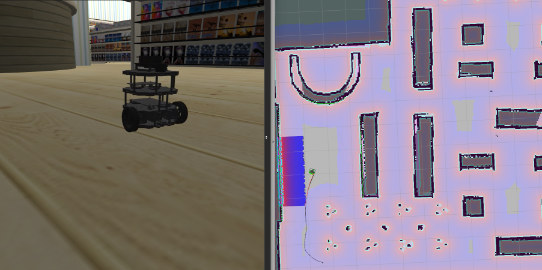
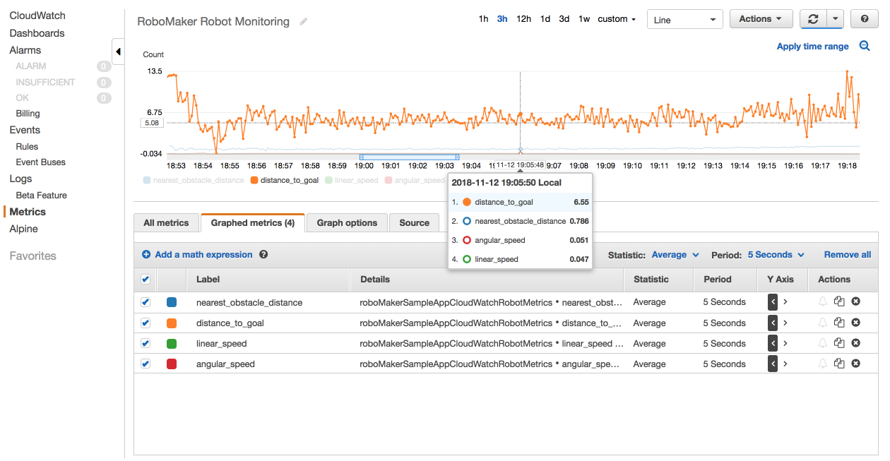

# AWS RoboMaker Sample Application - CloudWatch Monitoring

Monitor health and operational metrics for a fleet of robots in a simulated home using AWS CloudWatch Metrics and AWS CloudWatch Logs. Streamed metrics include speed, distance to nearest obstacle, distance to current goal, robot CPU utilization, and RAM usage.

It demonstrates how to emit metrics and logs to AWS CloudWatch to monitor your robots.

_RoboMaker sample applications include third-party software licensed under open-source licenses and is provided for demonstration purposes only. Incorporation or use of RoboMaker sample applications in connection with your production workloads or a commercial products or devices may affect your legal rights or obligations under the applicable open-source licenses. Source code information can be found [here](https://s3.console.aws.amazon.com/s3/buckets/robomaker-applications-us-east-1-72fc243f9355/cloudwatch/?region=us-east-1)._


## Requirements

- [ROS Kinetic](http://wiki.ros.org/kinetic/Installation/Ubuntu) / [ROS Melodic](http://wiki.ros.org/melodic/Installation/Ubuntu) - Other versions may work, however they have not been tested
- [Colcon](https://colcon.readthedocs.io/en/released/user/installation.html) - Used for building and bundling the application.

## AWS Setup

### AWS Credentials
You will need to create an AWS Account and configure the credentials to be able to communicate with AWS services. You may find [AWS Configuration and Credential Files](https://docs.aws.amazon.com/cli/latest/userguide/cli-config-files.html) helpful.

### AWS Permissions
To run this application you will need an IAM user with the following permissions:
```
   logs:PutLogEvents
   logs:DescribeLogGroups
   logs:DescribeLogStreams
   logs:CreateLogStream
   logs:CreateLogGroup
```

You can find instructions for creating a new IAM Policy [here](https://docs.aws.amazon.com/IAM/latest/UserGuide/access_policies_create.html#access_policies_create-start). In the JSON tab paste the following policy document:

```
{
  "Version": "2012-10-17",
  "Statement": [
    {
      "Sid": "CloudWatchRobotRole",
      "Effect": "Allow",
      "Action": [
        "cloudwatch:PutMetricData",
        "logs:PutLogEvents",
        "logs:DescribeLogGroups",
        "logs:DescribeLogStreams",
        "logs:CreateLogStream",
        "logs:CreateLogGroup"
      ],
      "Resource": "*"
    }
  ]
}
```

## Build

### Install requirements
Follow links above for instructions on installing required software.

### Pre-build commands

```bash
sudo apt-get update
rosdep update
```

### Robot

```bash
cd robot_ws
vcs import < .rosinstall
rosdep install --from-paths src --ignore-src -r -y
colcon build
```

### Simulation

```bash
cd simulation_ws
vcs import < .rosinstall
rosdep install --from-paths src --ignore-src -r -y
colcon build
```

## Run

The `TURTLEBOT3_MODEL` environment variable must be set when running both robot and simulation application. Currently only `waffle_pi` is supported. Set it by

```bash
export TURTLEBOT3_MODEL=waffle_pi
```

Launch the application with the following commands:

- *Running Robot Application on a Robot*
    ```bash
    source robot_ws/install/local_setup.sh
    roslaunch cloudwatch_robot deploy_rotate.launch
    ```

- *Running Robot Application in a Simulation*
    ```bash
    source robot_ws/install/local_setup.sh
    roslaunch cloudwatch_robot [command]
    ```
    There are two robot launch commands:
    - `rotate.launch` - The robot starts rotating
    - `await_commands.launch` - The robot is idle waiting movement commands, use this for teleop and navigation


- *Running Simulation Application*
    ```bash
    source simulation_ws/install/local_setup.sh
    roslaunch cloudwatch_simulation [command]
    ```
    There are three simulation launch commands for three different worlds:
    - `empty_world.launch` - Empty world with some balls surrounding the turtlebot at (0,0)
    - `bookstore_turtlebot_navigation.launch` - A retail space where the robot navigates to random goals
    - `small_house_turtlebot_navigation.launch` - A retail space where the robot navigates to random goals

    Alternatively, to run turtlebot navigation to follow dynamic goals,
    ```bash
    roslaunch cloudwatch_simulation [command] follow_route:=false dynamic_route:=true
    ``` 

Note that when running robot applications on a robot, `use_sim_time` should be set to `false` (which is the default value in `deploy_rotate.launch` and `deploy_await_commands.launch`). When running robot applications along with simulation applications, `use_sim_time` should be set to `true` for both applications (which is the default value in `rotate.launch`, `await_commands.launch` and all the launch files in simulation workspace).
   		  
When running simulation applications, run command with `gui:=true` to run gazebo client for visualization.

For navigation, you can generate a map with map generation plugin. See [this](#generate-occupancy-map-via-map-generation-plugin) for instructions.



### Run with a AWS Robomaker WorldForge world

Pre-requisite: Generate a map for your worldforge exported world following these [instructions](#generate-map-for-a-worldforge-world-with-default-config).

Build your workspace to reference the newly generated maps,
```bash
cd simulation_ws
colcon build
```

Launch the navigation application with the following commands:
```bash
export TURTLEBOT3_MODEL=waffle_pi
source simulation_ws/install/local_setup.sh
roslaunch cloudwatch_simulation worldforge_turtlebot_navigation.launch
```

### Monitoring with CloudWatch Logs
Robot logs from ROS nodes are streamed into CloudWatch Logs to Log Group `robomaker_cloudwatch_monitoring_example`. See `cloudwatch_robot/config/cloudwatch_logs_config.yaml`.

### Monitoring with CloudWatch Metrics
Robot metrics from ROS nodes are reported into CloudWatch Metrics `robomaker_cloudwatch_monitoring_example`. Metric resolution is configured at 10 seconds. See `cloudwatch_robot/config/cloudwatch_metrics_config.yaml`.

Operational metrics include:
- linear speed
- angular speed
- distance to nearest obstacle (closest lidar scan return)
- distance to planned goal (bookstore only, requires its navigation system)

Health metrics include CPU and RAM usage.



## Using this sample with RoboMaker

You first need to install colcon-ros-bundle. Python 3.5 or above is required.

```bash
pip3 install colcon-ros-bundle
```

After colcon-ros-bundle is installed you need to build your robot or simulation, then you can bundle with:

```bash
# Bundling Robot Application
cd robot_ws
source install/local_setup.sh
colcon bundle

# Bundling Simulation Application
cd simulation_ws
source install/local_setup.sh
colcon bundle
```

This produces the artifacts `robot_ws/bundle/output.tar` and `simulation_ws/bundle/output.tar` respectively.

You'll need to upload these to an s3 bucket, then you can use these files to
[create a robot application](https://docs.aws.amazon.com/robomaker/latest/dg/create-robot-application.html),
[create a simulation application](https://docs.aws.amazon.com/robomaker/latest/dg/create-simulation-application.html),
and [create a simulation job](https://docs.aws.amazon.com/robomaker/latest/dg/create-simulation-job.html) in RoboMaker.


## Generate Occupancy Map via map generation plugin

Procedurally generate an occupancy map for any gazebo world. This map can then be plugged in to navigate a robot in Worldforge worlds. For other aws-robotics worlds, this procedure is optional for the use-cases mentioned in this README. 


### Generate map for a aws-robotics world with default config

Currently, the following aws-robotics worlds are supported,
- [`bookstore`](https://github.com/aws-robotics/aws-robomaker-bookstore-world)  
- [`small_house`](https://github.com/aws-robotics/aws-robomaker-small-house-world)  
- [`small_warehouse`](https://github.com/aws-robotics/aws-robomaker-small-warehouse-world)  
- [`no_roof_small_warehouse`](https://github.com/aws-robotics/aws-robomaker-small-warehouse-world)


To generate a map, simply run
```bash
./scripts/genmap_script.sh <world_name>
```

where `<world_name>` can be any value in the list above.

### Generate map for a WorldForge world with default config

After exporting a world from WorldForge, unzip and move the contents under simulation_ws workspace

```bash
unzip exported_world.zip
mv aws_robomaker_worldforge_pkgs simulation_ws/src/

#For worldforge worlds, set WORLD_ID to the name of your WF exported world (eg: generation_40r67s111n9x_world_3),
export WORLD_ID=<worldforge-world-name>

# Run map generation script
./scripts/genmap_script.sh worldforge
```

### Generate map for a custom world with custom config

```bash
# Install dependencies (Ubuntu >18.04)
sudo apt-get install ruby-dev libxml-xpath-perl libxml2-utils
```

```bash
# Fetch and install ROS dependencies
cd simulation_ws
vcs import < .rosinstall
rosdep install --from-paths src -r -y
cd ..
```

```bash
# Run plugin with custom world/config,
python scripts/add_map_plugin.py custom -c <path-to-config> -w <path-to-world> -o <output-path>
```

```bash
# Build with plugin added
cd simulation_ws
colcon build
source install/local_setup.sh

# Start map service (for custom worlds, relocate your world file with the added plugin to src/cloudwatch_simulation/worlds/map_plugin.world before running this)
roslaunch cloudwatch_simulation start_map_service.launch

# Generate map (start in a different terminal AFTER you see "[INFO] [*] occupancy map plugin started" message in previous terminal)
rosservice call /gazebo_2Dmap_plugin/generate_map

# Save map
rosrun map_server map_saver -f <path-to-file> /map:=/map2d
```

```bash
# Move the generated map file to cloudwatch_simulation simulation workspace map directory
mv <path-to-file> simulation_ws/src/cloudwatch_simulation/maps/map.yaml
```

## AWS ROS Packages used by this Sample

- RoboMakerUtils-Common
- RoboMakerUtils-ROS1
- CloudWatch-Common
- CloudWatchLogs-ROS1
- CloudWatchMetrics-ROS1
- HealthMetricsCollector-ROS1
- MonitoringMessages-ROS1

## License

MIT-0 - See LICENSE for further information

## How to Contribute

Create issues and pull requests against this Repository on Github
