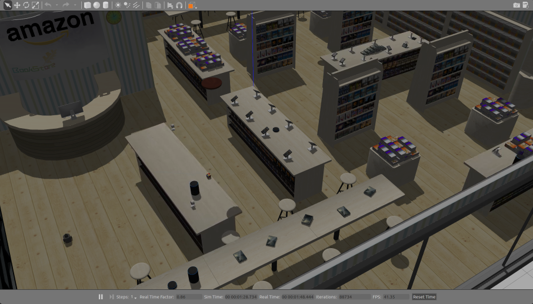

# AWS RoboMaker Simulation Bookstore ROS package



# Gazebo load
```bash
export GAZEBO_MODEL_PATH=`pwd`/models
gazebo worlds/bookstore.world
```

# ROS Launch (without a robot)
```bash
roslaunch aws_robomaker_simulation_bookstore bookstore.world
```

# Robot simulation
With Turtlebot Burger initially positioned near the service desk: 
```
export TURTLEBOT3_MODEL=waffle_pi
export ROBOT_INITIAL_POSE="-x 0.5 -y 1.0 -z 0.0 -R 0.0 -P 0.0 -Y 0.0"
roslaunch turtlebot_gazebo turtlebot_world.launch  world_file:=`pwd`/worlds/bookstore.world
```

# Navigation
A SLAM-generated map for *Turtlebot Waffle PI* is included.

Run:
```bash
roslaunch aws_robomaker_simulation_bookstore bookstore_turtlebot_navigation.launch 
```

Run with rviz:
```bash
roslaunch aws_robomaker_simulation_bookstore bookstore_turtlebot_navigation.launch open_rviz:=true
```

Run RViz separately:
```
rviz -d rviz/turtlebot3_navigation.rviz
```


# Include the world from another package
* Update .rosinstall to clone this repository and run `rosws update`
* Add the following to your launch file:
```xml
<launch>
  <!-- Launch World -->
  <include file="$(find aws_robomaker_simulations_bookstore)/launch/bookstore.launch"/>
  ...
</launch>
```
